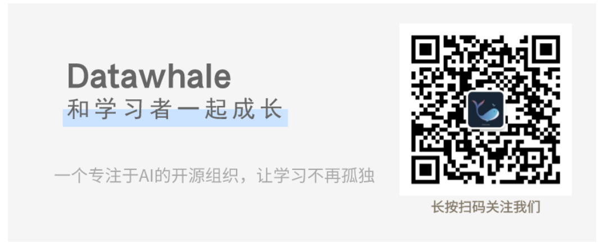

# Dive-into-DatawhaleTeamLearning
>Roll in the team learning from Datawhale

组队学习简介：

- 组队学习的目的：打磨自我技能，认识优秀伙伴，挖掘潜在组织成员，和学习者一起成长。
- 组队学习的方向：每个月第二个周六，组织一次学习活动，每次安排 10天左右 的学习任务，主要围绕以下六个方面进行开源内容建设。
    - 编程语言与数据结构
    - 数据挖掘基础算法
- 自然语言处理
- 计算机视觉
- 推荐系统
    - 强化学习
（3）往期组队学习计划：https://github.com/datawhalechina/team-learning 13

 